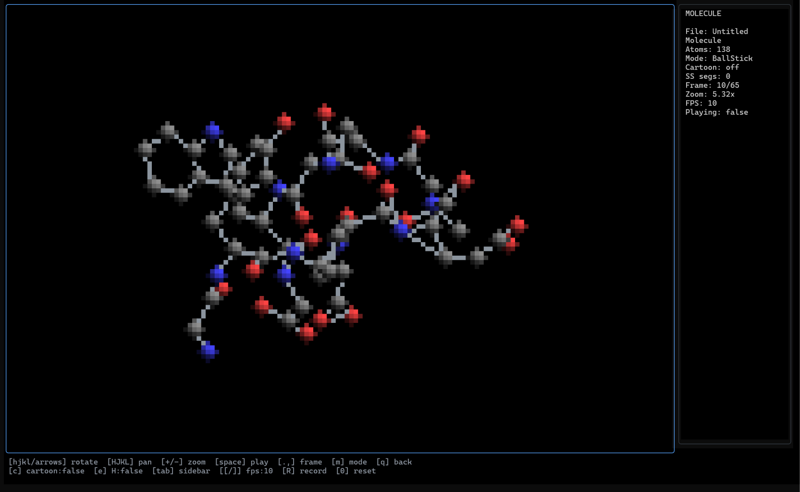

# MD-TUI

Terminal molecular-dynamics viewer built with Go + Bubble Tea — a tiny ChimeraX/VMD
in your terminal. Loads multi-frame PDB trajectories and renders them as true-colour
half-block "pixel" art with playback, rotation, zoom, a secondary-structure cartoon
mode, and animated-GIF recording, all on a fully black background.



## Requirements

- Go 1.22+

## Start

From the repo root:

```powershell
go mod tidy
go run .
```

The app opens in the current directory and lists `.pdb` files. Put your PDB files in this folder (or run the app from a folder that has them), then press `enter` on a file to open it.

## Build executable

```powershell
go build -o moltui.exe .
.\moltui.exe
```

## Controls

- `up/down` or `j/k`: navigate file picker
- `enter`: open selected PDB
- `q` or `esc`: back / quit
- `ctrl+c`: quit

Viewer:

- `arrows` / `hjkl` / `wasd`: rotate
- `HJKL` (shift): pan
- `+` / `-`: zoom
- `space`: play/pause frames
- `.` / `,`: next/previous frame
- `[` / `]`: slower/faster playback
- `m`: cycle render mode (SpaceFill -> BallStick -> Wireframe -> Cartoon/secondary structure)
- `c`: toggle cartoon (secondary-structure) overlay
- `e`: toggle hydrogens
- `tab`: toggle sidebar
- `R`: record the whole trajectory to an animated GIF next to the source PDB
- `0`: reset view

The Cartoon mode reads HELIX/SHEET records and draws alpha-helices as a wide purple
ribbon, beta-sheets as gold arrows, and coils/loops as a thin gray trace.
